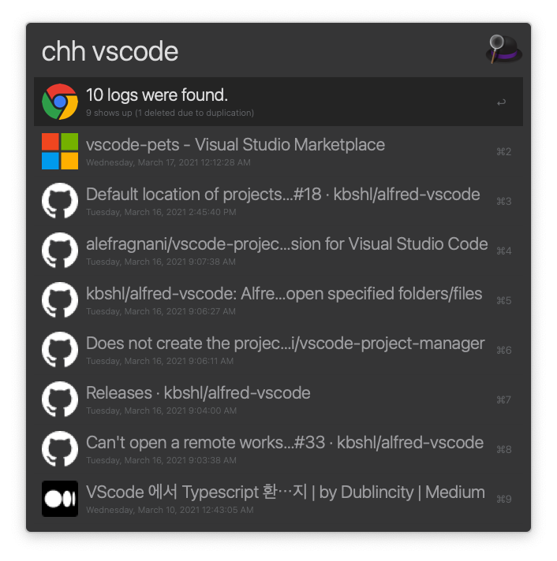
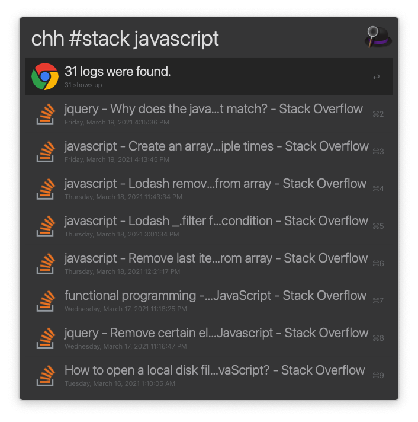
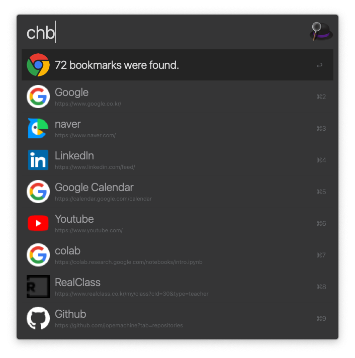
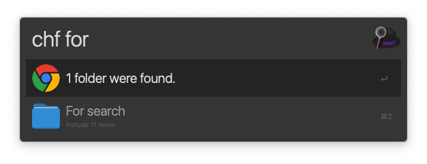
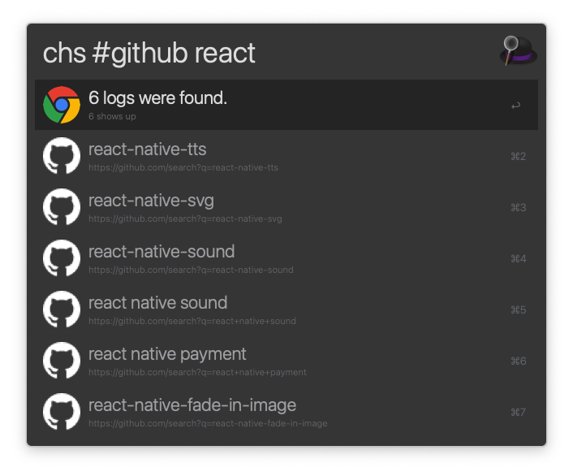
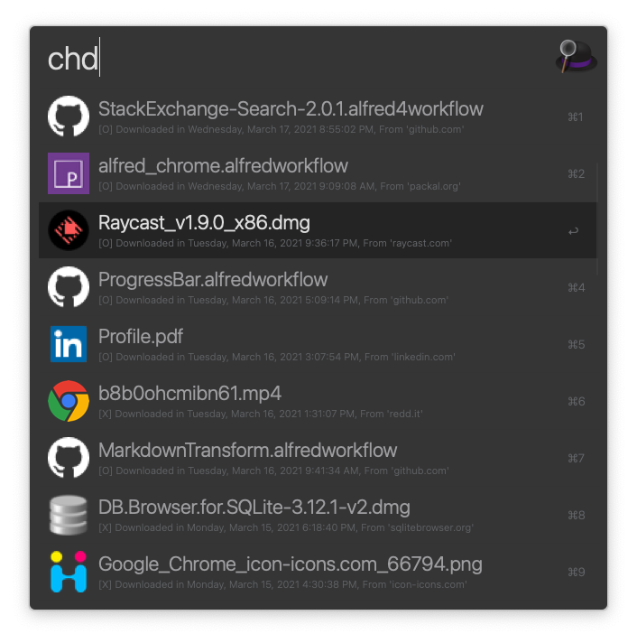
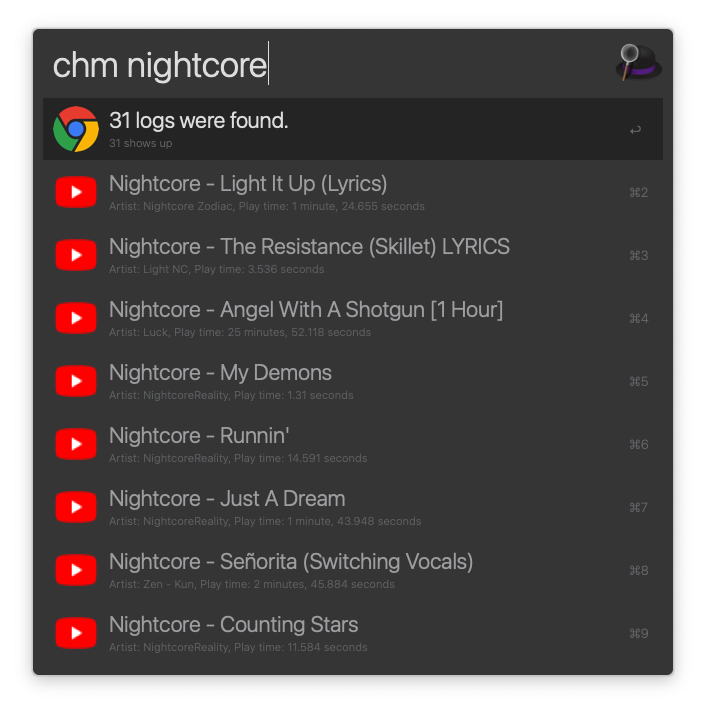
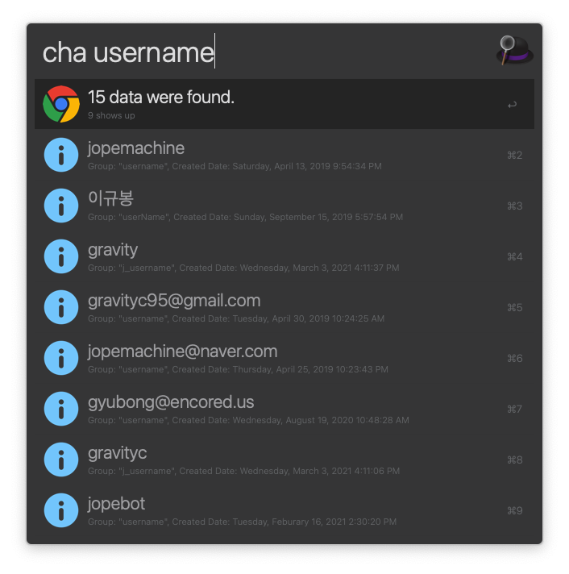

<h1 align="center">
  <a href="https://www.npmjs.com/package/alfred-chrome-workflow">
		Alfred-chrome-workflow<br>
	
	
	
  </a>
</h1>

Alfred workflow to search Chrome kernel based browser's queries, bookmarks, history and download logs, and other datas

## 🌈 Features

* 📄 *Search Chrome's Visit History `(chh)`*





* 🔖 *Search Chrome's Bookmark sorted by visit counts `(chb)`*



* 📁 *Search Chrome's Bookmark folder `(chf)`*



* 📜 *Search Chrome's Search query history `(chs)`*



* 🔎 *Search Chrome's Download logs `(chd)`*



* 🎥 *Search Chrome's Media (video) history `(chm)`*



* 📒 *Search and Copy Your Chrome's Autofill data `(cha)`*



* 📝 *You can change your search config details `(ch > conf)`*

## 📌 Prerequisite

The prerequisites below are required to use that package.

* Node JS

* [Chrome](https://www.google.com/intl/en/chrome/) or Chrome based browser (Chrome canary, edge, chromium.. etc)

* [Alfred powerpack](https://www.alfredapp.com/powerpack/)

##  🔨 How to install

1. **Install package by npm**

```
$ npm install --global alfred-chrome-workflow
```

If you have problem with installation with above command,

Please refer [these installaion issues](https://github.com/jopemachine/alfred-chrome-workflow/issues?q=is%3Aissue+is%3Aclosed+).

2. **Check your `chrome_profile` on `/Users/<username>/Library/Application Support/Google/Chrome/<chrome_profile>/`. default value is set by `Default`.**

If `chrome_profile` is not proper, you could encounter below error.


3. **If your `chrome_profile` is not default, change `chrome_profile` of `conf.json` to your profile name.**

4. **(Optional, Recommended) You can cache favicon images in advance by executing `ch > cache`**

By proceeding with the above process, you can assign favicon to the items of `chb` and increase search speed.

## 📗 How to use

### chb { Argument }

Argument: {`Term to search`}

Search chrome bookmark

(Could be sorted by `visit counts`, `alphabet`)

### chf { Argument }

Argument: {`Term to search`}

Search chrome bookmark folders

### chh { Argument }

Argument: {`Term to search`}

Search chrome visit history

You can append `#` to search word to search only the logs in that `url`.

Example:

`chh #youtube [some_word_to_search]`

### chd { Argument }

Argument: {`Term to search`}

Search chrome download history

### chs { Argument }

Argument: {`Term to search`}

Search your query based on visit history

You can append `#` to search word to search only the logs in that `url`.

Example:

`chs #github [some_word_to_search]`

### chm { Argument }

Argument: {`Term to search`}

Search chrome media history (like youtube watching history)

You can append `#` to search word to search only the logs in that `url`.

And you can append `@` to search word to search only the logs in that `artist`.

Example:

`chs #youtube @some_artist [some_word_to_search]`

### cha { Argument }

Argument: {`Term to search`}

Search chrome autofill data

### chid { Argument }

Argument: {`Term to search`}

Search chrome's login data (including email)

### ch > conf

Open config file (`conf.json`)

### ch > cache

Cache favicon images from your visit history in advance

### ch > clearcache

Clear favicon cache

## 🔖 Search Options

### common

* **chrome_profile**

Type: `string`

Your chrome profile name.

* **locale**

Type: `string (enum)`

Determines whether to display some string values in Korean or English.

Possible values: `ko` or `en`

* **browser**

Type: `string (enum)`

Select the browser to which you want the workflow to the workflow.

Possible values: `Chrome` or `Chrome Canary` or `Edge` or `Chromium`

* **exclude_domains**

Type: `string[]`

You can exclude specific domain's url in your search result. 

This is applied to `chs`, `chh`, `chm`. (Not `chb`)

### chh

* **result_limit**

Type: `number`

Displays as many search results in `chh` search as `result_limit`.

* **sort**

Type: `string`

Determine what to sort the search results in `chh`.

Recommended Value:

`last_visit_time DESC` Or `visit_count DESC, typed_count DESC, last_visit_time DESC`

* **delete_duplicate**

Type: `boolean`

Removes items with duplicate title names.

### chd

* **sort**

Type: `string (enum)`

Sort by `DESC` or `ASC`

### chb

* **sort**

Type: `string (enum)`

Sort by `VISIT_FREQ` or `ALPHABET`

### chs

* **result_limit**

Type: `number`

Displays as many search results in `chs` search as `result_limit`.

* **delete_duplicate**

Type: `boolean`

Removes items with duplicate title names.

### chm

* **sort**

Type: `string (enum)`

Sort item.

Possible Value: `artist`, `source_title`, `position_ms`, `last_updated_time_s`

`position_ms` sorts by watching time you played on the video.

`last_updated_time_s` sorts by recently viewed videos descending.

* **result_limit**

Type: `number`

Displays as many search results in `chm` search as `result_limit`.

* **delete_duplicate**

Type: `boolean`

Removes items with duplicate title names.

### cha

* **sort**

Type: `string (enum)`

Sort item.

Possible Value: `name`, `value`, `count`, `date_created`, `date_last_used`

`name` sorts by the form's name.

`value` sorts by the autofill data value.

`count` sorts by the numbers of the data is used.

`date_created` sorts by the dates of the data is created.

`date_last_used` sorts by the dates of the data is used last.

* **result_limit**

Type: `number`

Displays as many search results in `cha` search as `result_limit`.

* **delete_duplicate**

Type: `boolean`

Removes items with duplicate values.

## License

MIT © [jopemachine](https://github.com/jopemachine/alfred-chrome-workflow)